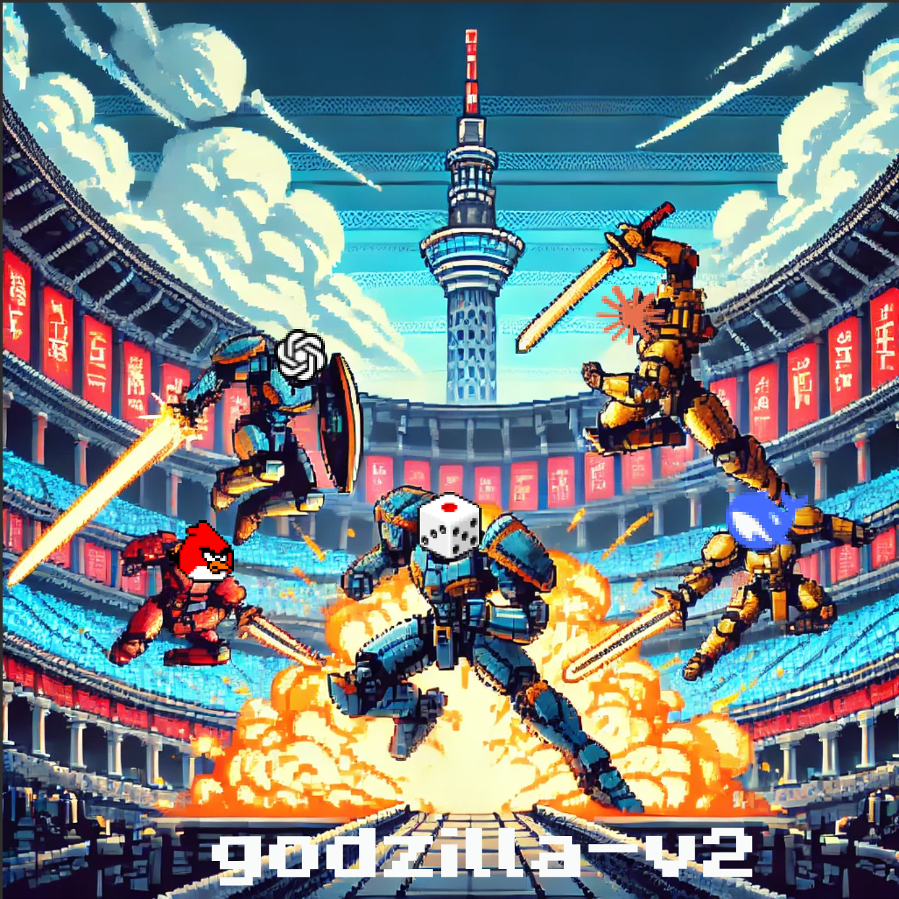

# godzilla-v2

godzilla-v2 is a super simplified king of tokyo game (derived heavily from [godzilla](https://github.com/haraschax/godzilla/)). The goal of this game is to create a benchmark for reasoning LLMs, and see how they fare against classic game playing techniques.

#### Simplifications from King of Tokyo
- There are no energy cubes
- There are no power cards to buy

I plan to add some version of power cards and energy later. But this simple game already offers nice dynamics, especially in a multi-player setting.



## Installation
```bash
uv venv
source .venv/bin/activate
uv pip install -r requirements.txt
```

## Running the game
```
usage: game.py [-h] --players {random,angry,human,openai,anthropic} [{random,angry,human,openai,anthropic} ...] [--n_games N_GAMES] [--verbose] [--report]

options:
  -h, --help            show this help message and exit
  --players {random,angry,human,openai,anthropic} [{random,angry,human,openai,anthropic} ...], -p {random,angry,human,openai,anthropic} [{random,angry,human,openai,anthropic} ...]
                        List of players (agent names) to participate in the game.
  --n_games N_GAMES, -n N_GAMES
  --verbose, -v         Print game logs.
  --report, -r          Generate game report.
```

#### 1. Play simple agents
```bash
python game.py --players {random,random,angry} --n_games 10000
```


#### 2. Play as a human against an agent! (the interface needs to be improved)
```bash
python game.py --players {angry,human} --n_games 1 --verbose
```

#### 3. Play an LLM against other agents
```bash
# before using an llm agent, you need to expose the API key in .env file at root directory
python game.py --players {angry,random,openai} --n_games 1 --verbose
```

### Visualize games
As of now you can generate a report, which gives a nice way to visualize the games + see the LLM reasoning!
```bash
python game.py --players {angry,random,anthropic} --n_games 1 --report
```

### Available agents
```python
# simple agents
- random
- angry

# interactivate agent
- human #(play with n_games=1 and verbose)

# llm agents
- openai
- anthropic
```

---

## Creating a new agent

- Create a file `agents/new_fancy_agent.py`
- Implement the two methods of the `Player` class: `keep_dice` and `yield_tokyo`
- Add the agent in `agent/__init__.py`